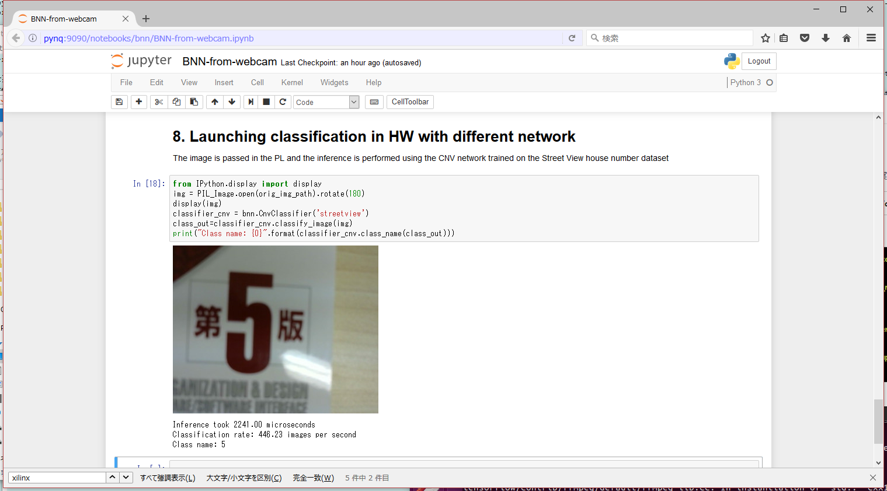

# BNN-from-webcam.ipynb を実行する
ディレクトリパスの調整が必要になります

ディレクトリを作成するためにターミナルで実行
```
mkdir /home/xilinx/jupyter_notebooks/bnn/data
```
pythonコード修正
```python
orig_img_path = '/home/xilinx/jupyter_notebooks/image.jpg'
...
output_file = open('/home/xilinx/jupyter_notebooks/bnn/data/image.images-idx3-ubyte', 'wb')
...
classifier.inference("/home/xilinx/jupyter_notebooks/bnn/data/image.images-idx3-ubyte")
...
classifier_sw3.inference("/home/xilinx/jupyter_notebooks/bnn/data/image.images-idx3-ubyte")
```
実行結果


修正後コード
```python
## 1.Instantiate the classifier
import bnn
print(bnn.available_params(bnn.NETWORK_LFC))

classifier = bnn.PynqBNN(network=bnn.NETWORK_LFC)


## 2. Download the network parameters
classifier.load_parameters("mnist")


## 3. Load the image from the camera
from PIL import Image as PIL_Image
from PIL import ImageEnhance
from PIL import ImageOps

orig_img_path = '/home/xilinx/jupyter_notebooks/image.jpg'
!fswebcam  --no-banner --save {orig_img_path} -d /dev/video0 2> /dev/null # Loading the image from the webcam

img = PIL_Image.open(orig_img_path).convert("L")                          # convert in black and white
#Image enhancement                
contr = ImageEnhance.Contrast(img)
img = contr.enhance(3)                                                    # The enhancement values (contrast and brightness) 
bright = ImageEnhance.Brightness(img)                                     # depends on backgroud, external lights etc
img = bright.enhance(4.0)          

img = img.rotate(180)                                                     # Rotate the image (depending on camera orientation)
#Adding a border for future cropping
img = ImageOps.expand(img,border=80,fill='white') 
img


## 4. Evaluate digit location in the image
from PIL import Image as PIL_Image
import numpy as np
import math
threshold = 180  
img = img.point(lambda p: p > threshold and 255)  
immat = img.load()
(X, Y) = img.size
m = np.zeros((X, Y))
# Spanning the image to evaluate center of mass
for x in range(X):
    for y in range(Y):
        m[x, y] = immat[(x, y)] <= 250
m = m / np.sum(np.sum(m))
dx = np.sum(m, 1)
dy = np.sum(m, 0)

# Evalate center of mass
cx = math.ceil(np.sum(dx * np.arange(X)))
cy = math.ceil(np.sum(dy * np.arange(Y)))
img = img.crop((cx-80,cy-80,cx+80,cy+80))

img


## 5. Convert to BNN input format
from array import *
from PIL import Image as PIL_Image
#Resize the image and invert it (white on black)
smallimg = img.resize((28, 28))
smallimg = ImageOps.invert(smallimg)


data_image = array('B')

pixel = smallimg.load()
for x in range(0,28):
	for y in range(0,28):
		data_image.append(pixel[y,x])      
        
# Setting up the header of the MNIST format file        
hexval = "{0:#0{1}x}".format(1,6)
header = array('B')
header.extend([0,0,8,1,0,0])
header.append(int('0x'+hexval[2:][:2],16))
header.append(int('0x'+hexval[2:][2:],16))
header.extend([0,0,0,28,0,0,0,28])
header[3] = 3 # Changing MSB for image data (0x00000803)

data_image = header + data_image
# mkdir /home/xilinx/jupyter_notebooks/bnn/data
output_file = open('/home/xilinx/jupyter_notebooks/bnn/data/image.images-idx3-ubyte', 'wb')
data_image.tofile(output_file)
output_file.close()
smallimg


## 6. Launching BNN in hardware
classifier.inference("/home/xilinx/jupyter_notebooks/bnn/data/image.images-idx3-ubyte")


## 7. Launching BNN in software
classifier_sw3 = bnn.PynqBNN(network=bnn.NETWORK_LFC,runtime=bnn.RUNTIME_SW)
classifier_sw3.load_parameters("mnist")
classifier_sw3.inference("/home/xilinx/jupyter_notebooks/bnn/data/image.images-idx3-ubyte")


## 8. Launching classification in HW with different network
from IPython.display import display
img = PIL_Image.open(orig_img_path).rotate(180)
display(img)
classifier_cnv = bnn.CnvClassifier('streetview')
class_out=classifier_cnv.classify_image(img)
print("Class name: {0}".format(classifier_cnv.class_name(class_out)))
```

