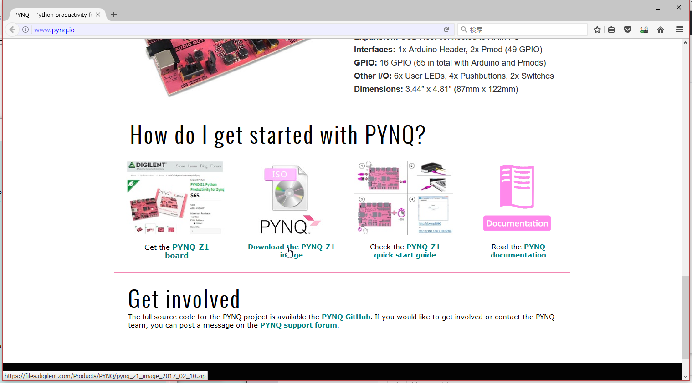
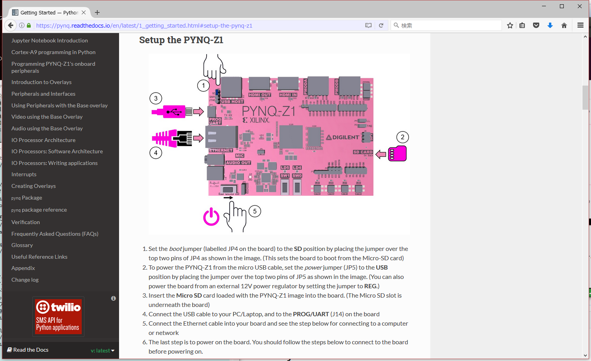
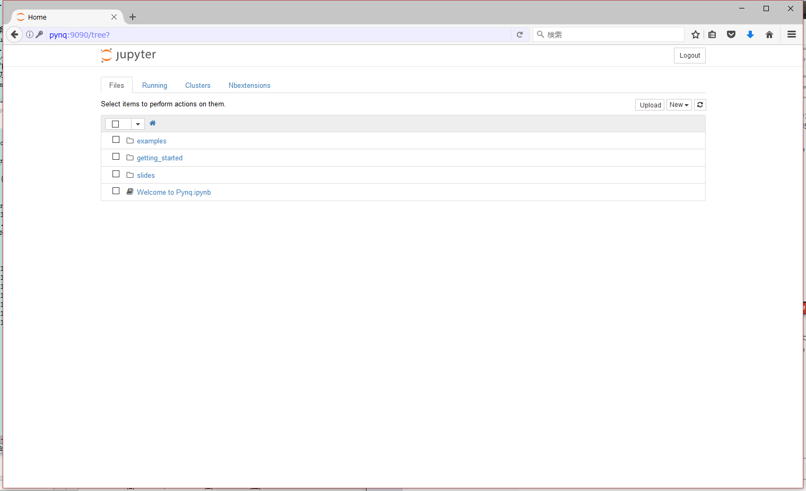

# PYNQ-Z1 起動から更新まで

##### 用意するもの
* LANケーブル
* microUSBケーブル
* SDカード(microSD)
* PYNQ-Z1本体
* fing(iOS/Androidアプリ)もしくはネットワークデバイス検索ツール

##### SDカードにOSイメージを書き込みます
古いイメージを使うと、
```
root@pynq:/home/xilinx# ./scripts/update_pynq.sh 
Updating to latest stable release (default action)
Info: This operation will overwrite all the example notebooks
Press any key to continue...
Cloning Pynq repo
Cloning into '/home/xilinx/pynq_git'...
remote: Counting objects: 13904, done.
remote: Total 13904 (delta 0), reused 0 (delta 0), pack-reused 13904
Receiving objects: 100% (13904/13904), 76.36 MiB | 1.96 MiB/s, done.
Resolving deltas: 100% (8367/8367), done.
Checking connectivity... done.
Checking out files: 100% (1123/1123), done.
checking out v1.4

Verifying current SDCard image supports this pynq release.

PYNQ Github Release v1.4
This software is not backwards-compatible with a PYNQ SDCard v1.3 image.
Please upgrade SDCard image on www.pynq.io

/home/xilinx/pynq_git/scripts/linux/makefile.pynq:58: recipe for target 'revision_check' failed
make: *** [revision_check] Error 1

```
と出て更新できないので、最新のOSイメージをDLします。
http://www.pynq.io/

2017/04/20 時点
https://files.digilent.com/Products/PYNQ/pynq_z1_image_2017_02_10.zip

起動イメージのSDカードを作るには、Windowsなら「Win32DiskImager」を使って作ることが出来ます。

PYNQ-Z1の電源を入れる前に、ジャンパピンの状態を確認します。
https://pynq.readthedocs.io/en/latest/1_getting_started.html#setup-the-pynq-z1

1. ①JP4ラベルのジャンパピンがSD側に刺さっていること(SDカードから起動)
2. ①JP5ラベルのジャンパピンがUSB側に刺さっていること(USB給電)
3. ②SDカードが刺さっていること
4. USB電源ケーブルが刺さっていること(PC/Laptopに繋ぐとあるけど、給電なのでUSB給電できればよい)
5. LANケーブルが刺さっていること
6. 電源スイッチをONにして起動

起動したら、fing(iOS/Androidアプリ)でpynq-z1のIPアドレスを探してsshでログインします。
```
ssh xilinx@192.168.0.56
password:xilinx
```
更新をかけるとsambaの設定が行われ、jupyterで接続可能になります。
```
sudo su
apt-get update
apt-get upgrade # ここでjupyterで接続可能に！
apt-get dist-upgrade
```
pynq_z1_image_2017_02_10.imgでjupyterにつなげるためのポイント: apt-get upgradeでsambaの設定が走ること
```
root@pynq:/home/xilinx# apt-get upgrade
Reading package lists... Done
Building dependency tree       
Reading state information... Done
Calculating upgrade... Done
0 upgraded, 0 newly installed, 0 to remove and 0 not upgraded.
1 not fully installed or removed.
After this operation, 0 B of additional disk space will be used.
Do you want to continue? [Y/n] 
Setting up samba (2:4.1.17+dfsg-4ubuntu2) ...
Processing triggers for libc-bin (2.21-0ubuntu4) ...
root@pynq:/home/xilinx# 
```

http://pynq:9090 でjupyterにアクセス可能となります。
password:xilinx


##### pynq関連+jupyter notebookの更新
apt-getでは更新できないため、git pullで更新するためのスクリプトが用意されています。

./scripts/update_pynq.sh
ただし、これを実行してもエラーで終了になるので、エラーになったらshスクリプトを見てやりたいことを手入力します。
```
root@pynq:/home/xilinx# ./scripts/update_pynq.sh 
Info: This operation will overwrite all the example notebooks
Press any key to continue...
Cloning Pynq repo master
Cloning into '/home/xilinx/pynq_git'...
remote: Counting objects: 13904, done.
remote: Total 13904 (delta 0), reused 0 (delta 0), pack-reused 13904
Receiving objects: 100% (13904/13904), 76.36 MiB | 3.06 MiB/s, done.
Resolving deltas: 100% (8367/8367), done.
Checking connectivity... done.
Checking out files: 100% (1123/1123), done.
fatal: A branch named 'master' already exists.
root@pynq:/home/xilinx# 
```
エラーになったら、スクリプトに記載されていることと同じように、git用に作られたディレクトリに移動してバージョンをcheckoutしてmakeします。
```
root@pynq:/home/xilinx# ls
jupyter_notebooks  pynq  pynq_git  REVISION  scripts
root@pynq:/home/xilinx# cd pynq_git
root@pynq:/home/xilinx/pynq_git# git describe --tags `git rev-list --tags --max-count=1`
v1.4
root@pynq:/home/xilinx/pynq_git# git checkout -q v1.4
root@pynq:/home/xilinx/pynq_git# make -f /home/xilinx/pynq_git/scripts/linux/makefile.pynq update_pynq 

Verifying current SDCard image supports this pynq release.
Completed

Build libsds_lib

cd /home/xilinx/pynq_git/scripts/xlnkutils && make && make install
make[1]: Entering directory '/home/xilinx/pynq_git/scripts/xlnkutils'
gcc wrapper.c -fPIC -shared -rdynamic -o libsds_lib.so -Wl,--whole-archive libsds_lib.a -l pthread  -Wl,--no-whole-archive
make[1]: Leaving directory '/home/xilinx/pynq_git/scripts/xlnkutils'
make[1]: Entering directory '/home/xilinx/pynq_git/scripts/xlnkutils'
cp -avf libsds_lib.so /usr/lib/
‘libsds_lib.so’ -> ‘/usr/lib/libsds_lib.so’
cp -arvf libxlnk_cma.h /usr/include/
‘libxlnk_cma.h’ -> ‘/usr/include/libxlnk_cma.h’
make[1]: Leaving directory '/home/xilinx/pynq_git/scripts/xlnkutils'

Pip install latest pynq python package

python3.6 /home/xilinx/scripts/stop_pl_server.py
rm -rf /opt/python3.6/lib/python3.6/site-packages/pynq/*
cp -rf /home/xilinx/pynq_git/Pynq-Z1/sdk/bin/*.bin /home/xilinx/pynq_git/python/pynq/iop/
cp -rf /home/xilinx/pynq_git/Pynq-Z1/bitstream /home/xilinx/pynq_git/python/pynq/
cd /home/xilinx/pynq_git/python ; sudo -H python3.6 -m pip install --upgrade .
Processing /home/xilinx/pynq_git/python
Installing collected packages: pynq
  Found existing installation: pynq 1.4
    Uninstalling pynq-1.4:
      Successfully uninstalled pynq-1.4
  Running setup.py install for pynq ... done
Successfully installed pynq-1.4
python3.6 /home/xilinx/scripts/start_pl_server.py &

Update scripts and notebooks

cp -arf /home/xilinx/pynq_git/Pynq-Z1/notebooks/* /home/xilinx/jupyter_notebooks
cp -f /home/xilinx/pynq_git/scripts/linux/rc.local /etc/
mkdir -p /home/xilinx/jupyter_notebooks/getting_started
mkdir -p /home/xilinx/jupyter_notebooks/getting_started/images
cp /home/xilinx/pynq_git/docs/source/3_jupyter_notebook.ipynb \
/home/xilinx/jupyter_notebooks/getting_started/1_jupyter_notebook.ipynb
cp /home/xilinx/pynq_git/docs/source/4_programming_python.ipynb \
/home/xilinx/jupyter_notebooks/getting_started/2_programming_python.ipynb
cp /home/xilinx/pynq_git/docs/source/5_programming_onboard.ipynb \
/home/xilinx/jupyter_notebooks/getting_started/3_programming_onboard.ipynb
cp /home/xilinx/pynq_git/docs/source/8_base_overlay_iop.ipynb \
/home/xilinx/jupyter_notebooks/getting_started/4_base_overlay_iop.ipynb
cp /home/xilinx/pynq_git/docs/source/9_base_overlay_video.ipynb \
/home/xilinx/jupyter_notebooks/getting_started/5_base_overlay_video.ipynb
cp /home/xilinx/pynq_git/docs/source/10_base_overlay_audio.ipynb \
/home/xilinx/jupyter_notebooks/getting_started/6_base_overlay_audio.ipynb
chown -R xilinx:xilinx /opt/python3.6/lib/python3.6/site-packages/pynq/*
chmod -R a+rw /home/xilinx/jupyter_notebooks /opt/python3.6/lib/python3.6/site-packages/pynq
chmod -R a+x /home/xilinx/scripts/*
chmod a+x /root/*.sh
chmod a+x /etc/rc.local
chown -R xilinx:xilinx /home/xilinx/jupyter_notebooks /home/xilinx/scripts /opt/python3.6/lib/python3.6/site-packages/pynq
Notebooks     folder is at: /home/xilinx/jupyter_notebooks
Scripts       folder is at: /home/xilinx/scripts

Completed PYNQ update.
```
pynqとjupyterが更新出来たようです。
